# **Boudoir Studio - Testing** 

[Main README.md file](/README.md)

[View live project](https://boiann.github.io/boudoir-studio/index.html)

[View GitHub repository](https://github.com/Boiann/boudoir-studio)

---
## **Contents**
* [Automated Testing](#automated-testing)
  * [W3C Validator](#w3c-validator)
  * [Lighthouse](#lighthouse)

* [Accessibility](#accessibility) 
  * [WAVE WebAim](#wave-webaim) 

* [Manual Testing](#manual-testing)
  * [Testing User Stories](#testing-user-stories)
  * [Full Testing](#full-testing)
    * [Features](#features)
    * [Responsiveness](#responsiveness)

* [Bugs](#bugs)
  * [Known Bugs](#known-bugs)
  * [Solved Bugs](#solved-bugs)

* [Browser Compatibility](#browser-compatibility)      

---

## Automated Testing

### **W3C Validator**
The [W3C Markup Validator](https://validator.w3.org/) service was used to validate the HTML and CSS code used.

Results of the HTML test of [Home page](https://boiann.github.io/boudoir-studio/index.html "Link to Boudoir Studio home page"):

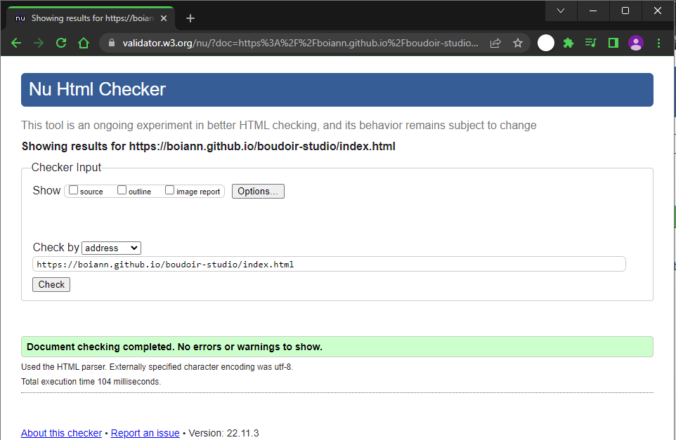

Results of the HTML test of [Gallery page](https://boiann.github.io/boudoir-studio/gallery.html "Link to Boudoir Studio gallery page"):

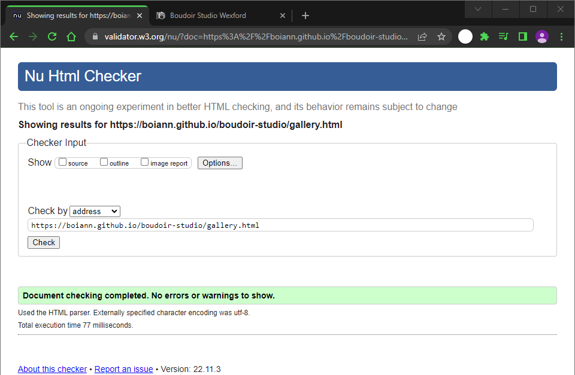

Results of the HTML test of [About Us page](https://boiann.github.io/boudoir-studio/about.html "Link to Boudoir Studio about us page"):

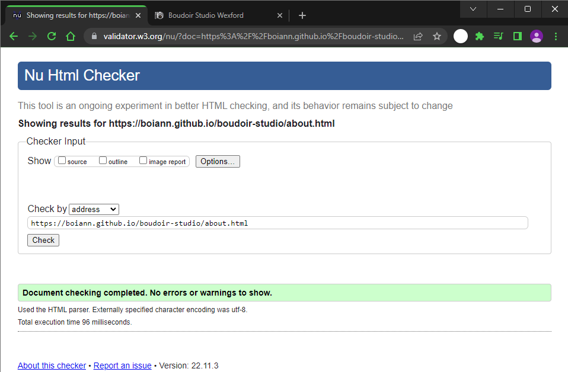

Results of the HTML test of [Thank You page](https://boiann.github.io/boudoir-studio/thanks.html "Link to Boudoir Studio thank you page"):

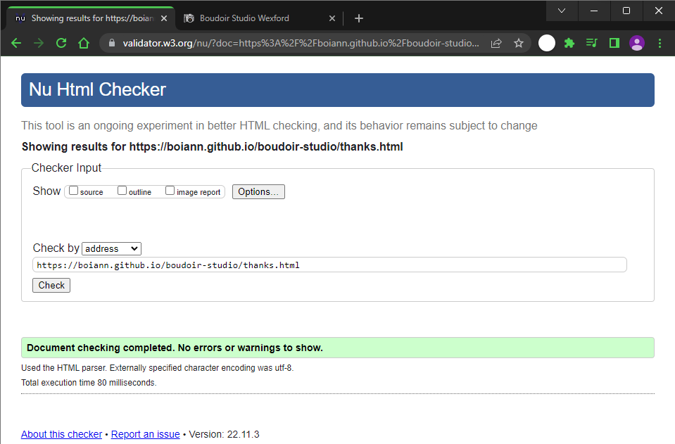

Results of the CSS test of [style.css](assets/css/style.css "Link to main style.css file"):

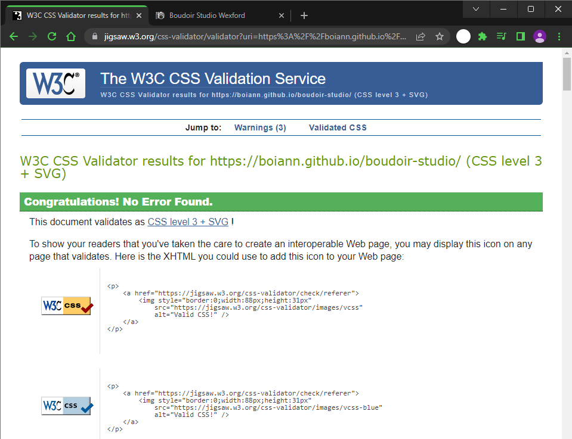

Results of the CSS test of [thanks_page_style.css](assets/css/thanks_page_style.css "Link to thanks_page_style.css for Thank You Page"):

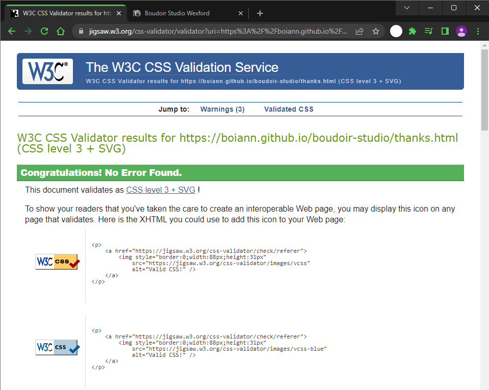

### **Lighthouse**
The performance test of all the pages was done with Lighthouse through Google Chrome Developer Tools, both for desktop and mobile devices.

Lighthouse test results for [Home page](https://boiann.github.io/boudoir-studio/index.html "Link to Boudoir Studio home page"):

* Desktop:

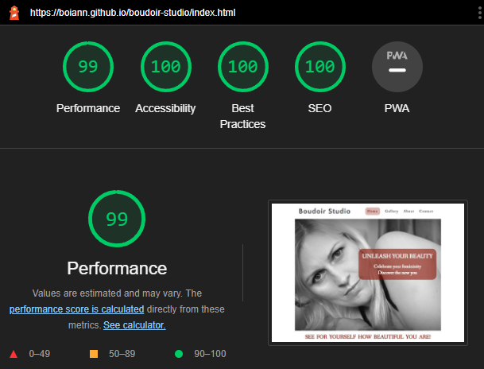

* Mobile:

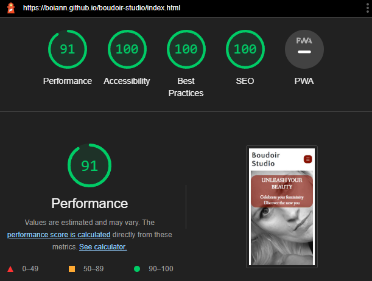

Lighthouse test results for [Gallery page](https://boiann.github.io/boudoir-studio/gallery.html "Link to Boudoir Studio gallery page"):

* Desktop:

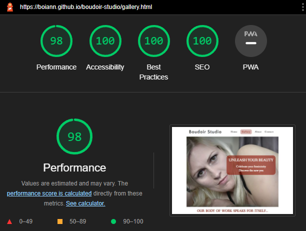

* Mobile:

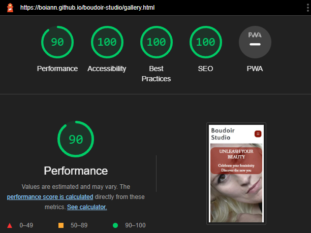

Lighthouse test results for [About Us page](https://boiann.github.io/boudoir-studio/about.html "Link to Boudoir Studio about us page"):

* Desktop:

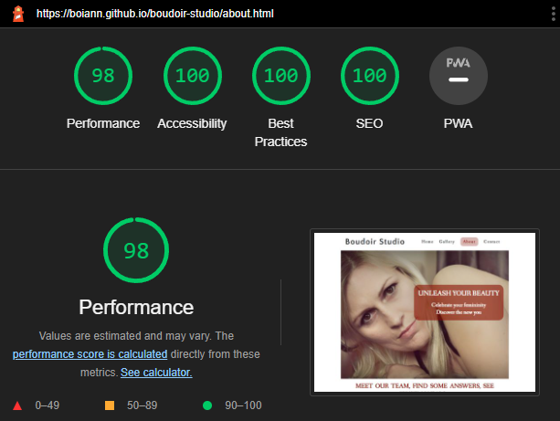

* Mobile:

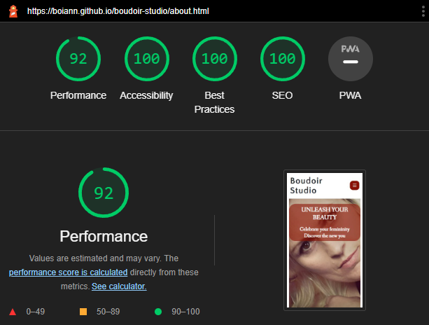

Lighthouse test results for [Thank You page](https://boiann.github.io/boudoir-studio/thanks.html "Link to Boudoir Studio thank you page"):

* Desktop:

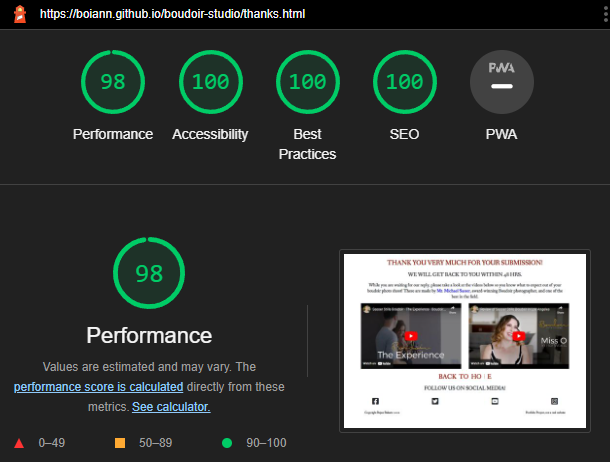

* Mobile:

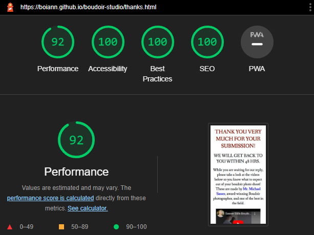

---

## **Accessibility**
### **WAVE WebAim**
The [WAVE WebAIM](https://wave.webaim.org/ "Link to WAVE WebAIM home page") web accessibility evaluation tool was used to check for accessibility standards. All pages pass with zero errors.

Results of the evaluation test of [Home page](https://boiann.github.io/boudoir-studio/index.html "Link to Boudoir Studio home page"):

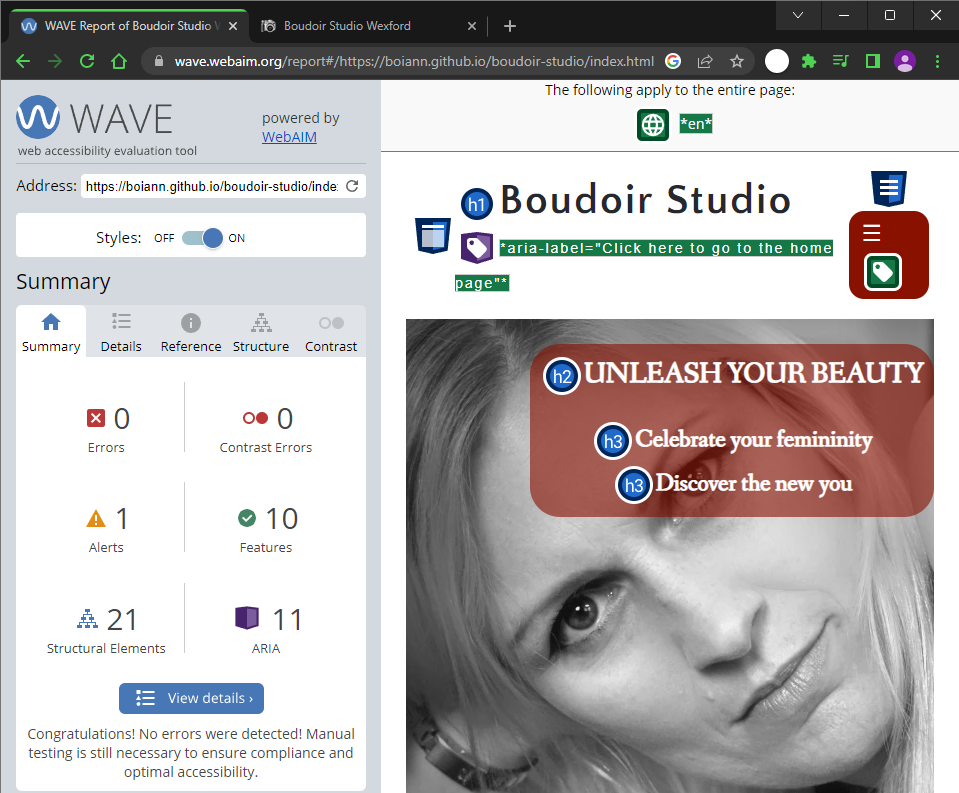

Results of the evaluation test of [Gallery page](https://boiann.github.io/boudoir-studio/gallery.html "Link to Boudoir Studio gallery page"):

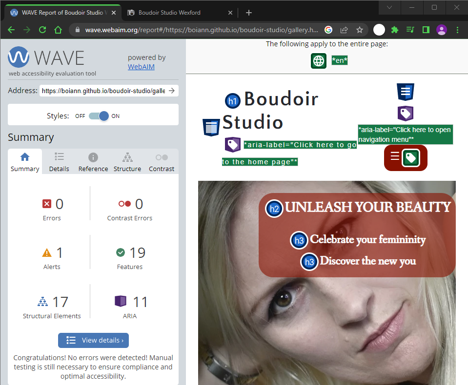

Results of the evaluation test of [About Us page](https://boiann.github.io/boudoir-studio/about.html "Link to Boudoir Studio about us page"):

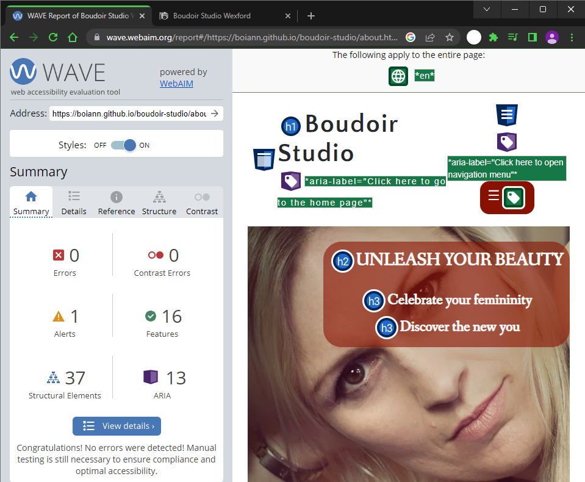

Results of the evaluation test of [Thank You page](https://boiann.github.io/boudoir-studio/thanks.html "Link to Boudoir Studio thank you page"):

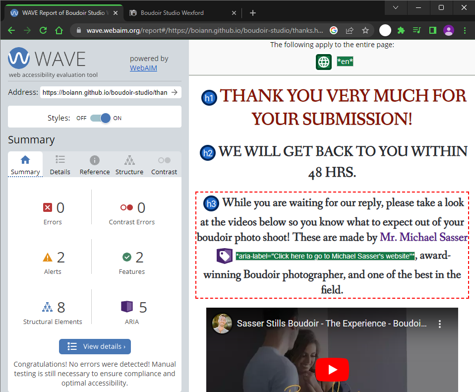

---

## **Manual Testing**
### **Testing User Stories**

#### **First Time Visitor**
  * **I want to know what Boudoir Photograpy is**
    * The [Home page](https://boiann.github.io/boudoir-studio/index.html "Link to Boudoir Studio home page") contains the needed info even without the user interaction. As soon as the page loads the cover text in the hero image will tell the user what is the Studio about: "Unleash your beauty, celebrate your femininity, discover the new you." This is enough to spark interest in the user and when scrolling down, the user is greeted with a banner text "See For Yourself How Beautiful You Are!" This is another short motivator, followed by a section that explains exactly what Boudoir Photography is. Users interested in more content can learn about Boudoir history and why its benefits, as well as why should the user consider using this business.
  * **I want to navigate the website intuitively**
    * The navigation bar is clearly defined and discernable. As per industry standards, it is located in the upper right section of the header. Hovering over the links in the navigation bar will change in colour and transform in size slightly, adding to the interaction. When selecting another page the user will be shown the active one with changed background. The "Back to Top" button will also appear when the user scrolls down enabling the user to quickly navigate to the top of the page. The button will present itself with a low opacity as to appear non-intrusive to the user, but when hovered over and/or used, it will transition into high opacity colour. The contact link in the navigation bar is present in all pages and quickly leads the user to the contact form.   
  * **I want to find additional information**
    * Using intuitive navigation between all of the pages of the website the user will have access to all the basic information about Boudoir Photography and the business itself. The [Home page](https://boiann.github.io/boudoir-studio/index.html "Link to Boudoir Studio home page") acts as a information about Boudoir, the [Gallery page](https://boiann.github.io/boudoir-studio/gallery.html "Link to Boudoir Studio gallery page") serves as a photography portfolio expected in this type of business, and the [About Us page](https://boiann.github.io/boudoir-studio/about.html "Link to Boudoir Studio about us page") page is about the team, testimonials and past clients with a FAQ section answering even more questions. The whole website is set up in a way that will enable the user to make an informed decision to use the Studio's services, requiring only a contact to set up the shoot or to ask more questions should the potential client have one. The FAQ is presented in accordion style menu to to increase interaction and aesthetics.
  * **I want to check out the social media of the business**
    * As per industry standards the social media links/icons are present in the bottom/footer area in all of the website pages, enabling the user to quickly discern between the four options; Facebook, Twitter, Youtube and Instagram. All of the links open in a separate tab, and have hover background transition effect to increase interaction and aesthetics.

#### **Returning User**
  * **I want to know about the business owner/team**
    * Users interested in the team behind the business will easily and intuitively navigate to [About Us page](https://boiann.github.io/boudoir-studio/about.html "Link to Boudoir Studio about us page") page where the short biographies and descriptions of the team can be found. To make the team appear more friendly and approachable all of them have a photo of themselves above the bio.  
  * **I want to see the portfolio of the Studio**
    * Users interested in the portfolio of the business will easily and intuitively navigate to [Gallery page](https://boiann.github.io/boudoir-studio/gallery.html "Link to Boudoir Studio gallery page") where the gallery consisting of twelve photographs can be found.
   All of the photographs have a slight hover effect applied to them to increase interaction with the user and aesthetics.
  * **I want to know what other people said about the experience with the business**
    * Users interested in testimonials will easily and intuitively navigate to [About Us page](https://boiann.github.io/boudoir-studio/about.html "Link to Boudoir Studio about us page") page where short one-line reviews/testimonials can be found. The testimonials section is indicated to the user in a text banner below the hero image, "Meet our Team, Find Some Answers, See Testimonials..." Testimonials themselves serve to connect the idea of doing Boudoir Photography with real-life former clients with various jobs, age and appearance. This is to put the potential new client at ease and show that Boudoir is truly for all women.
  * **I want to contact the Studio**
    * The contact form is easily navigable using the Contact link in the navigation bar that will automatically scroll to the form section of the page. This feature is present on all the pages. The form requires correct inputs from the user, not allowing the user to submit query without submitting their name and surname, email and text. Upon submitting, the user is rewarded with [Thank You page](https://boiann.github.io/boudoir-studio/thanks.html "Link to Boudoir Studio thank you page") page where their query is acknowledged and feedback about reply timeframe is given. There are also two videos to further put the potential client at ease and inform them about Boudoir Photography shoot process. 

#### **Website Owner**
  * **I want to provide basic information about Boudoir Photography and who is it for**
    * The whole website is made with providing all of the info necessary for the potential client to make an informed decision on using this business.
  * **I want potential clients to be able to reach us quickly**
    * The contact process is made to be quick to find, easily accessible and rewarding to the user.
  * **I want to provide our body of work**
    * Whole page, [Gallery page](https://boiann.github.io/boudoir-studio/gallery.html "Link to Boudoir Studio gallery page"), is dedicated to provide the user with photography portfolio of the business. 
  * **I want potential clients to follow us on social media**
    * The footer section present on all pages serves to provide user with links to the social media of the website.

### **Full Testing**

#### **Features**

**Testing features present on all pages of the website:**

* Navigation bar links opening pages and hover effect:
<!-- img -->

* Navigation bar contact link scrolling to contact section:
<!-- img -->

* Hero image fixed effect:
<!-- img -->

* Contact section hover effect:
<!-- img -->

* Map section interaction with the map:
<!-- img -->

* Social media icons hover effect:
<!-- img -->

* Social media icons opening in a new tab:
  * Facebook:
  <!-- img -->

  * Twitter:
  <!-- img -->

  * Youtube:
  <!-- img -->

  * Instagram:
  <!-- img -->

* Back to top button appearing, dissapearing, hover effect
  <!-- img -->

* Hamburger menu working/opening links:
  <!-- img -->

**Testing features present on specific pages of the website:**

 * [Home page](https://boiann.github.io/boudoir-studio/index.html "Link to Boudoir Studio home page"):
   * Wiki link for named artist in Boudoir History opening in a new tab
   <!-- img -->

* [Gallery page](https://boiann.github.io/boudoir-studio/gallery.html "Link to Boudoir Studio gallery page"):
  * Gallery images hover effect:
  <!-- img -->

* [About Us page](https://boiann.github.io/boudoir-studio/about.html "Link to Boudoir Studio about us page"):
  * FAQ section accordion and hover effect:
  <!-- img -->

* [Thank You page](https://boiann.github.io/boudoir-studio/thanks.html "Link to Boudoir Studio thank you page"):
  * Controls present and no autoplay on videos:
  <!-- img -->
  * Back to home link animation and opening home page working:
  <!-- img -->

#### **Responsiveness**

Responsiveness of the whole website was thoroughly tested for devices up to 320px wide. 
The website still works on a device 230px wide, with visible problems with footer social media icons below that width.

Responsiveness test for each page:
* [Home page](https://boiann.github.io/boudoir-studio/index.html "Link to Boudoir Studio home page"):
  

* [Gallery page](https://boiann.github.io/boudoir-studio/gallery.html "Link to Boudoir Studio gallery page"):
     

* [About Us page](https://boiann.github.io/boudoir-studio/about.html "Link to Boudoir Studio about us page"):
    

* [Thank You page](https://boiann.github.io/boudoir-studio/thanks.html "Link to Boudoir Studio thank you page"):
  

---

## **Bugs**

### **Known Bugs**

* Bug reported by Boris B. (developer's brother):
On his mobile phone Samsung Galaxy A30s there are no pop-up warnings about missing name/surname/email/text when trying to submit contact form.
The form is still working as expected (not allowing submission) but the notifications are absent.
Upon about it the developer spent time on Google and Stack Overflow but has failed to come to a satisfactory answer/fix. 

The bug however, is not present on any other devices used to check the form: Samsung Galaxy A50, Samsung Galaxy A51, Samsung Galaxy S8+.
The bug is also absent when using Chrome Developer Tools Device Toolbar.

Due to the nature of the bug, the developer feels it is safe to proceed with finalization of the project. 

### **Solved Bugs**

There were many bugs/issues encountered during the development of this website. The major ones are listed below.
All of them were solved with [Google](https://google.com/ "Google home page") and in most cases with the help of the community on [Stack Overflow](https://stackoverflow.com/ "Stack Overflow home page") website.

* Images display issue with images not displayed properly or distorted. 
* Map issue with trying to have the interactive map working and display properly.
* Video embedding issue when trying to have it working and display properly. Problem was caused mostly with the design choice by the developer choosing to have two videos side by side.
* Images not loading when the website was published, fix visible from commits for this project repository named "Fix image paths for website deployment." The bug was was caused by not investigating the issue properly and multiple attempts to fix the issue were made without refreshing the cache and resetting internet connection.
* Bug with Javascript integration in the project. The developer was writing the Javascript code into the head of the HTML files, thinking that is where it belongs. Numerous hours later, tens of Javascript code tryouts and finally investigating in Chrome Developer Tools the developer found out the script should be at the bottom of the HTML code, at the end of the body section. The solution was found here: https://bobbyhadz.com/blog/javascript-cannot-read-property-style-of-null#:~:text=To%20resolve%20the%20%22Cannot%20read,the%20getElementById%20method%20returns%20null%20.
* Issue raised when using [WAVE WebAIM](https://wave.webaim.org/ "Link to WAVE WebAIM home page") tool to check the website accessibility. The test showed one error: missing label for the text area in the form. The developer applied a quick fix without properly investigating the issue, visible from multiple commits needed. After proper investigation correct label was implemented and styled into the website.

---

## **Browser compatibility**
The website was tested on the following browsers with no issues found:

* Google Chrome:
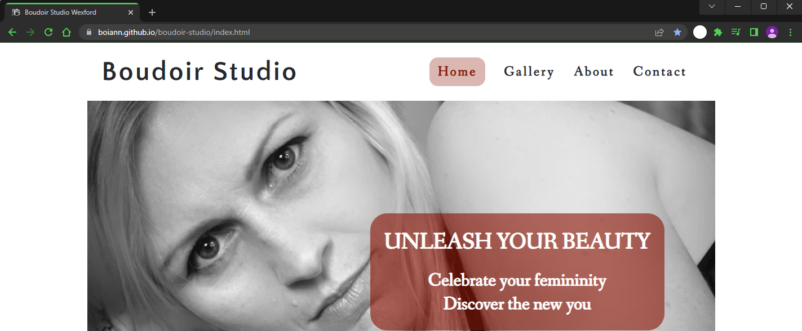

* Mozzilla Firefox:
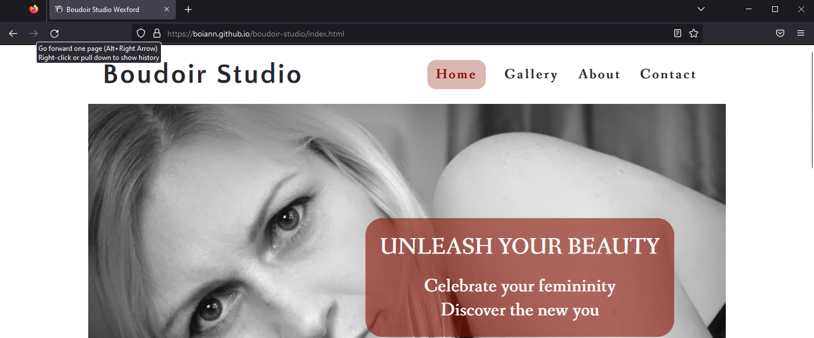

* Microsoft Edge:
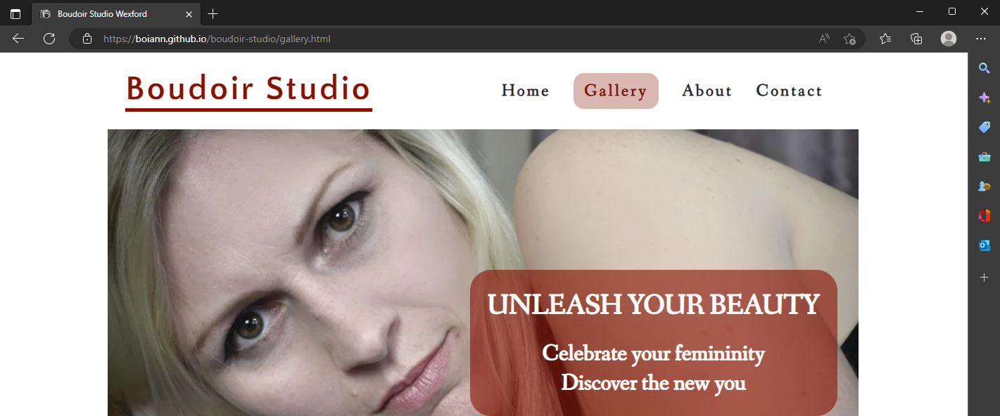

* Opera Browser:
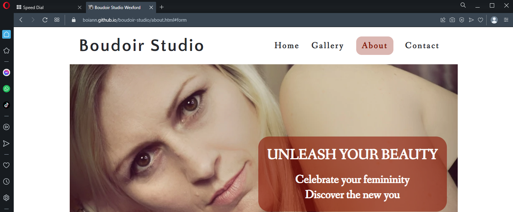

---

[Back to top ⇧](#boudoir-studio---testing)